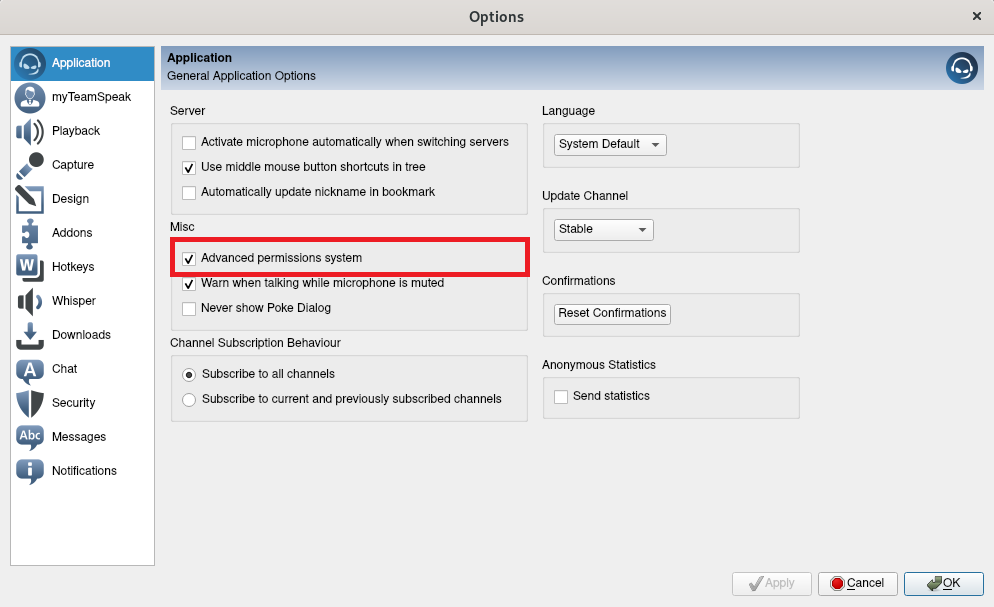

# TS3 Bot
Simple Teamspeak 3 bot based on the ts3API located at
https://github.com/Murgeye/ts3API.

# Table of Contents
- [Getting the bot](#getting-the-bot)
- [Configuration](#configuration)
- [Running the bot](#running-the-bot)
	- [Permissions](#permissions)
	- [Use SSH](#using-ssh)
- [Standard Plugins](#standard-plugins)
	- [Utils](#utils)
	- [AfkMover](#afkmover)
	- [Quotes](#quotes)
- [Standard commands](#standard-commands)
	- [Utils](#utils-1)
	- [AfkMover](#afkmover-1)
	- [Quotes](#quotes-1)
- [Writing plugins](#writing-plugins)
	- [Adding setup and exit methods](#adding-setup-and-exit-methods)
	- [Adding a text command](#adding-a-text-command)
		- [@group](#group)
	- [Listening for events](#listening-for-events)
- [Troubleshooting](#troubleshooting)

# Getting the bot
1. Clone this repository
2. Update the ts3API submodule by running `git submodule update --init --recursive` in the directory created in 1.
3. Install dependencies for the api by running `pip3 install -r ts3/requirements.txt`.
4. (Optional) Install optional dependencies for ssh by running `pip3 install -r ts3/optional_requirements.txt`.

# Configuration
You need a configuration file called config.ini in the bots root directory.
config.example.ini should help to get you started with that. The format of the
config file is as follows:

```
[General]
#Nickname of the bot
Botname: ExampleBot
#IP or dns name of the server
Host: 127.0.0.1
#Server query port
Port: 10011 
#Virtual Server id, usually 1 if you are running only one server
ServerId: 1 
#Channel to move the bot to on joining the server
DefaultChannel: Botchannel
#Server Query Login Name
User: serveradmin
#ServerQueryPassword
Password: password
# Use SSH connection
SSH: False
# Accept all SSH host keys (do not leave this enabled)
AcceptAllSSHKeys = True
# File to load and save host keys to
SSHHostKeyFile = ssh_hostkeys
# Load system wide host keys
SSHLoadSystemHostKeys = False

#Configuration for Plugins, each line corresponds to 
#a plugin in the modules folder
[Plugin]
#Format is: ModuleName, python module name
#You can use module paths by using points:
#e.g.: complex_module.example_module => module/complex_module/example_module
#The module name is only used for logging, it can be anything, but not empty
AfkMover: afkmover
UtilCommand: utils
```

# Running the bot
You can run the bot by executing main.py. If you intend to run the bot on boot
you should probably create a bash script that sleeps before starting the bot to 
allow the Teamspeak server to startup first:
```
#!/bin/bash
cd /path/to/bot
sleep 60
./main.py &> output.log
```

## Permissions
If you want your users to be able to see and message the bot, you will have to change
some server permission -- either for specific clients or for server groups. These are
the `i_client_serverquery_view_power` (set it to 100 if you want a client/group to be 
able to see the bot) and the `i_client_private_textmessage_power` (set it to 100 if you
want a client/group to be able to write textmessages (and therefore commands) to the bot).

Alternatively, you could modify the needed power for both permissions for the serverquery.

To see these permission settings you have to enable advanced permissions under
`Tools->Options` in your client.



## Using SSH
Since server version 3.3 TeamSpeak supports encrypted server query clients. To achieve this
the connection is wrapped inside a SSH connection. As SSH needs a way to check the host RSA
key, four config options were added:
* SSH: `[y/n/True/False/0/1]` Enables SSH connections (do not forget to enable it on the server
and change the port as well)
* AcceptAllSSHKeys: `[y/n/True/False/0/1]` Accept all RSA host keys
* SSHHostKeyFile: File to save/load host keys to/from
* SSHLoadSystemHostKeys: `[y/n/True/False/0/1]` Load system wide host keys

To add your host key the following workflow is easiest:
1. Activate AcceptAllHostKeys and set a SSHHostKeyFile
2. Connect to the server
3. The servers host key is automatically added to the file
4. Deactivate AcceptAllHostKeys

# Standard Plugins
All existing functionality is based on plugins.
## Utils
A small plugin with some convenience commands for administration and fun.
## AfkMover
Moves people from and to a specific channel upon marking themselves as AFK/back. To change the
channel to move people to change `channel_name`at the top of the `modules/afkmover.py` file.
## Quotes
A module to save quotes and send them to people joining the server. You can add famous quotes
or (for lots of fun) quotes from people on your server. See standard commands for info on how to
do that.

# Standard commands
All of the textcommands are added via plugins (see the next section). Current plugins include:
## Utils
A small plugin with some convenience commands for administration and fun.
* !hello - Answers with a message depending on the server group(Server Admin, Moderator, Normal)
* !stop - Stop the bot
* !restart - Restart the bot
* !multimove channel1 channel2 - Move all users from channel 1 to channel 2 (should work for channels containing spaces, most of the time)
* !kickme - Kick yourself from the server.
* !whoami - Fun command.
* !version - Answer with the current module version

## AfkMover
* !startafk/!afkstart/!afkmove - Start the Afk Mover
* !stopafk/!afkstop  Stop the AFK Mover

## Quotes
* !addquote quote - Add a new quote

# Writing plugins
A feature of this bot that it is easily extendable. You can see some example plugins
in the directory modules. To write your own plugin you need to do the following things:

1. Create a python module in the modules folder (or a subfolder)
2. Add the plugin to the config.ini

That's it. The plugin doesn't do anything yet, but we can build up on that.

## Adding setup and exit methods
Upon loading a plugin the ModuleLoader calls any method marked as `@setup` in the plugin.
```
from Moduleloader import *

@setup
def setup_module(ts3bot):
  #Do something, save the bot reference, etc
  pass
```

Upon unloading a module (usually if the bot is closed etc) the ModuleLoader calls any method
marked as `@exit` in the plugin.
```
@exit
def exit_module():
  #Do something, save your state, etc
  pass
```

## Adding a text command
You can register your plugin to specific commands (starting with !) send via private message
by using the `@command` decorator.
```
@command('test1','test2',)
@group('Server Admin',)
def test_command(sender, msg):
  print("test")
```
This registers the test_command function for the command !test1 and !test2. You can register a
function for as many commands as you want and you can register as many functions for a command as you want.

The `sender` argument is the client id of the user who sent the command, `msg` contains the whole text
of the private message.
### `@group`
The `@group` decorator specifies which Server Groups are allowed to use this function via textcommands. You can
use regex here so you can do things like `@group('.*Admin.*','Moderator',)` to allow all groups containing the
word Admin and the Moderator group to send this command. `@group('.*')` allows everybody to use a command. If
you don't use `@group` the default will be to allow access to 'Server Admin' and 'Moderator'.

## Listening for events
You can register a function in your plugin to listen for specific server events by using the `@event` decorator.
```
import ts3.Events as Events
# ...
@event(Events.ClientEnteredEvent,)
def inform_enter(event):
  print("Client with id " + event.client_id + " left.")
```
This code snippet registers the `inform_enter` function as a listener for the `Events.ClientEnteredEvent`. You
can register a function for multiple events by passing a list of event types to the decorator. To learn more
about the events look at the ts3.Events module.

# Troubleshooting
## The bot just crashes without any message
Any error messages should be in the file bot.log in the root directory of the bot.
If this file doesn't exist the file permissions of the root directory are probably wrong.

## The bot connects but I cannot see it.
First, make sure that you have set up the server permissions correctly as mentioned in the
[Permissions](#permissions) section. In addition to this, you might have to enable the
"Show ServerQuery Clients" setting in your TeamSpeak client under Bookmarks->Manage Bookmarks
and reconnect to the server. You might have to enable advanced settings for this.


If you still cannot see the bot after reconnecting, check if the bot is really still connected
by checking the logs of both the bot and the server. If you cannot find the problem, feel free
to open a new issue.

## The bot does not react to commands.
The bot can only handle commands via direct message. If you are sending a direct message and the bot still
does not react, try setting the permissions as mentioned in the [Permissions](#permissions) section.

## The bot always loses connection after some time.
Your `query_timeout`parameter in the `ts3server.ini` file is probably very low (<10 seconds).
Please set it to a higher value or 0 (this disables the query timeout). If this does not fix
it, feel free to open an issue, there might still be some unresolved problems here.

## The Bot gets banned from our server!
You need to whitelist the ip the bot is connecting from in the Teamspeak configuration file. To do this
change the file `query-ip-whitelist.txt` in the server directory and add a new line with your ip.

## Something doesn't work
The bot writes quite some logs in the root directory. Check those for errors and open
an issue if the issue remains.

## The bot stopped working after I updated my server!
Update the bot! Server version 3.4.0 changed the way the query timeout was handled.
Versions of the bot older then 17. September 2018 will not work correctly.
